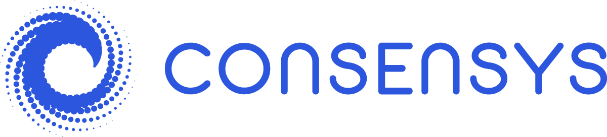

# Homework Unit 1
## FinTech Company Case Study

### Overview and Origin
* ConsenSys Inc.
* Founded in 2014 by Joseph Lubin and Andrew Keys
* Lubin was one of the original founders of Ethereum and wanted to encourage the adoption and development of the platform.  
* ConsenSys was [originally](https://www.coinspeaker.com/jpmorgan-quorum-consensys/) funded by their own Ethereum wealth, but have had a recent seed funding round ([$10M](https://www.crunchbase.com/organization/consensus-systems/company_financials)) and a fundraise with JP Morgan when they merged Quorum into ConsenSys (total amount unknown).  

### Business Activities
* ConsenSys has been created to help blockchain companies solve issues regarding regulation, deployment, funding, etc. when developing and bringing to market a new product or service.  
* They are heavily invested in Ethereum and build active clients and products on the open source blockchain.
* Their main targeted customers are either established companies who need assistance implementing eterprise level development solutions (i.e.- blockchain consulting) or individuals who will be the end users of their "[Web3](https://learn.consensys.net/catalog/info/id:182)" products (MetaMask, Infura, Diligence, Codefi, etc.)
* The biggest advantage ConsenSys has is that they are uniquely positioned to be able to develop, fund and deliver a wide range of products and services to different classes of customers.  There are companies that invest in blockchain ([Pantera Capital, Polychain Capital, Coinbase Ventures, etc.](https://www.block123.com/en/feature/top100-crypto-venture-capital-firms)) and there are companies that develop blockchain ([Bitfury, IBM, LeewayHertz, etc.](https://hackernoon.com/top-blockchain-development-companies-2019-rebi3zo8)), but very few that do both. ConsenSys has successfully merged those two domains together and continues to grow their umbrella of supported [companies/projects](https://labs.consensys.net/portfolio/).

### Landscape
* ConsenSys is a bit of a jack-of-all-trades, but the best domains they fall under are Blockchain Development and Venture Capital. In particular, developing and investing in Ethereum projects/companies.
* The current blockchain industry all started with Satoshi Nakamoto's Bitcoin in [2009](https://en.wikipedia.org/wiki/History_of_bitcoin).  Since then there have been new blockchain projects, forks of existing blockchains and an explosion of layer 2 solutions built on top of existing blockchains.  The biggest blockchain (aside from Bitcoin) to emerge from that development was Ethereum.  Ethereum is an open source protocol that utilizes blockchain and smart contracts to perform decentralized transactions. The appeal of Ethereum is that, at it's core, it is a protocol that allows decentralized apps (dApps) to be built on top of it. These dApps range in function from Cryptokitties to decentralized finacial (deFi) products.  DeFi is perhaps the most exciting genre of dApps to be developed as they allow for bankless transactions in roles that have, historically, required banks or bank-like entities.  Some examples include lending/borrowing ([Compound](https://compound.finance/)), trading ([Uniswap](https://uniswap.org/), [Kyber](https://kyberswap.com/limit_order/knc-weth)), stable coins ([USDC](https://www.circle.com/en/usdc), [DAI](https://makerdao.com/en/)), and decentralized bet making ([Augur 2.0](https://augur.net/)).  Many of which are direct beneficiaries of the ConsenSys venture capital arm.
* ConsenSys does not currently have any direct competitors that comnbine both the Venture Captial domain and the Blockchain development domain.  However, you can look at the two domains, separately, to see who ConsenSys would be competing against in that particular domain:
    * **Venture Capital**:
        * _[Pantera Capital](https://www.panteracapital.com/about)_: founded in 2013 as the first US Bitcoin investment firm.  They are now focused on investing exclusively in blockchain technolgies. 
        * _Polychain Capital_: a hedge fund that invests in blockchain projects and tokens.  
        * _[Coinbase Ventures](https://ventures.coinbase.com/)_: Coinbase is one of the most established crypto exchanges in the world and, in 2018, have begun to invest back into the industry they trade. Coinbase Ventures invests in early stage companies in order to spur development of the cyrpto ecosystem.
    * **Blockchain Development**:
        * _[IBM](https://www.ibm.com/blockchain)_: perhaps the biggest name on this list, IBM is a staple in the technology field.  IBM has jumped into the blockchain fray and offers several blockchain services at the enterprise and supply chain level.
        * _[Bitfury](https://bitfury.com/)_: a software and hardware development company that focuses on developing blockchain solutions. They also happen to be one of the most successful Bitcoin ASIC mining producers in the world. 
        * _[LeewayHertz](https://www.leewayhertz.com/)_: a software development company that uses emerging technologies to solve their customer's issues.  From machine learning to robotic process automation to apps development, they cover just about all of it including blockchain development.

### Results
* To date, ConsenSys has invested in or developed hundreds of applications/projects/companies and have seen many of those become very successful.  Some examples include Metamask, Hyperledger Besu, Infura, BlockFi, Compound, and RocketPool.  
* Metrics for performance are very difficult to quantify for ConsenSys given a few reasons:
    * They are a private company without a lot of financial data available.
    * The blockchain development/investment space is relatively new still and therefore doesn't have great industry adopted metrics.
    * There are very few peers to compare ConsenSys (as a whole) back to.  
* While metrics are difficult to obtain for ConsenSys, I believe you can look at the quality of their investments, developments and partnerships to measure their success.  While this is not quantitative measure, it does give you a sense of how well ConsenSys is doing of meeting their goal of developing the blockchain ecosystem.
    * The merging of JP Morgan's Quorum and JPM Coin along with a subsequent parternship with and investment by JP Morgan into ConsenSys is perhaps the biggest signal that ConsenSys is accomplishing this goal.  JP Morgan has millions of customers and being able to integrate those users could potentially lead to significant inroads to mass adoption of blockchain technologies.  
    * Metamask has now been downloaded over 4 million times, Diligence is now protecting over 100 blockchain companies and Hyperledger Besu has been downloaded over 130,000 times.  All three of these were developed by ConsenSys.  While those numbers may be small compared to a Microsoft or Apple, they are quite impressive for the flegling blockchain industry.  
    * While there are no available financial metrics for investments, there are over 100 blockchain companies within the ConsenSys investment arm. Included are some of the most successful deFi and Web3 dApps and companies.  To be able to recognize successful companies early on is a hallmark "must-have" for any profitable investment company, much less a blockchain investment company.  

### Recommendations
* I would like to recommend that ConsenSys develop a token that allows [unaccredited investors](https://www.fool.com/investing/2018/02/14/what-is-a-qualified-investor.aspx#:~:text=A%20qualified%20investor%2C%20also%20commonly,offerings%2C%20and%20other%20private%20placements.) to participate in some of the early round venture capital projects.  The token would likely look much like an equity investment in ConsenSys' investment arm and could even pay out a dividend depending on the invested capital's return (meaning SEC regulation).  The token would be at the ConsenSys company level and therefore allow unaccredited investors to have an indirect involvement in early stage projects.  There could even be a governance aspect to the token that would allow token holders to vote on what projects to bring in and how much to allocate to them.  ConsenSys would essentially only be the middle man in identifying and sourcing new projects.  As the value of the investments go up, then the value of the token would go up, or speculation of the value would drive the token price up.  ConsenSys could monetize this token in a couple of different ways:
    * Extract a management fee,
    * At creation of the token, retain a large number of tokens and wait for the tokens to appreciate in value.
* With the recent crackdown of the ICO craze by the SEC, there are very few opportunities for retail investors to be able to participate in early stage development projects.  With several successful companies having accrued a value of 10-100x of their original valuations, this prevents the little guy from seeing the large return multiples that the venture capital companies often see.  This also has the affect of making capital harder to come by for new teams that are looking to establish their idea/project.  By offering this token it would allow ConsenSys to do these four main things:
    * Fill the demand from retail investors to participate in early stage development companies.
    * Provide a new pool of capital to capital hungry startups.
    * Reduce their exposure to risky investments by managing a capital fund rather than using their own capital. 
    * Create another source of revenue through either management fees or token value appreciation, or both.
* Ethereum smart contracts seem like the most logical solution to use in this case.  Ethereum is a proven technology that would allow the transfer of capital from ConsenSys to token holders decentrally.  As the capital fund acquires income, that income could be distributed out to the token holders in a tranparent and predictable manner.  The smart contracts could also be used to control any governance type logic that would be built into the token.

### _Addendum_
#### Sources:
* Copmany data (founders, incorporation date, seed funding, etc.): https://www.crunchbase.com/organization/consensus-systems
* Original Funding came from Ethereum wealth: https://www.coinspeaker.com/jpmorgan-quorum-consensys/
* ConsenSys Website: https://consensys.net/
* ConsenSys Web3 webinar: https://learn.consensys.net/catalog/info/id:182
* Epicenter Pod Cast with Joe Lubin: https://epicenter.tv/episodes/ethcc-joe-lubin
* Top Blockchain Companies: https://hackernoon.com/top-blockchain-development-companies-2019-rebi3zo8
* Top Blockchain Investment companies: https://www.block123.com/en/feature/top100-crypto-venture-capital-firms
* ConsenSys Portfolio: https://labs.consensys.net/portfolio/
* The History of Bitcoin: https://en.wikipedia.org/wiki/History_of_bitcoin
* Uniswap: https://uniswap.org/
* Compound: https://compound.finance/
* Kyber: https://kyberswap.com/limit_order/knc-weth
* Circle's USDC: https://www.circle.com/en/usdc
* MakerDAO's DAI: https://makerdao.com/en/
* Augur 2.0: https://augur.net/
* Qualified Investors: https://www.fool.com/investing/2018/02/14/what-is-a-qualified-investor.aspx#:~:text=A%20qualified%20investor%2C%20also%20commonly,offerings%2C%20and%20other%20private%20placements.
